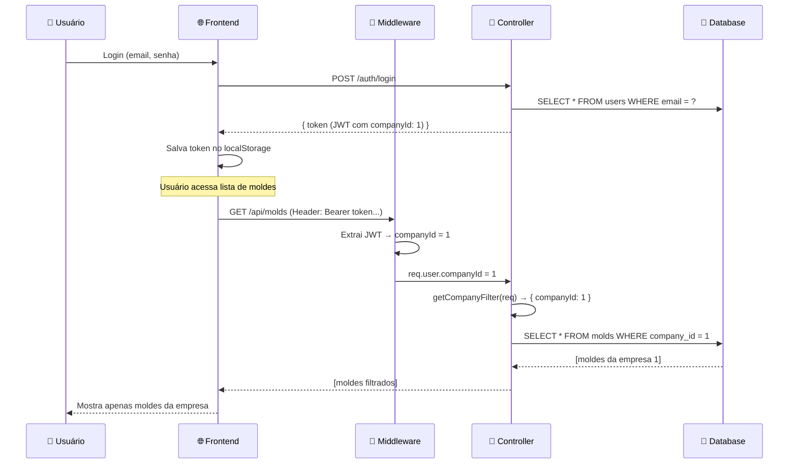

# 🔍 Como Funciona o Vínculo da Empresa - Guia Prático

## 📊 Resumo Executivo

Seu sistema **JÁ ESTÁ IMPLEMENTADO** com filtro multi-empresa! Aqui está como funciona:

### ✅ O que já funciona:
1. **Moldes** → Filtrados por `companyId` automaticamente
2. **Itens** → Filtrados por `companyId` automaticamente  
3. **Ordens de Produção** → Filtradas por `companyId` automaticamente
4. **JWT** → Carrega `companyId` do usuário logado

### ⚠️ O que precisa de atenção:
1. **Apontamentos** → Vínculo indireto (via ProductionOrder)
2. **Paradas (Downtime)** → Vínculo indireto (via ProductionOrder)

---

## 🎯 Fluxo Completo (Passo a Passo)

### 1️⃣ **Login do Usuário**
```typescript
// Usuário faz login
POST /api/auth/login
{
  "email": "operador@empresa.com",
  "password": "senha123"
}

// Se tiver múltiplas empresas:
Response: {
  "requiresCompanySelection": true,
  "companies": [
    { "id": 1, "name": "Empresa ABC" },
    { "id": 2, "name": "Empresa XYZ" }
  ]
}

// Usuário seleciona empresa:
POST /api/auth/select-company
{
  "userId": 1,
  "companyId": 1
}

// Recebe token JWT com companyId:
Response: {
  "token": "eyJhbGciOi...",  // ← JWT contém companyId: 1
  "company": { "id": 1, "name": "Empresa ABC" }
}
```

---

### 2️⃣ **Estrutura do Token JWT**
```json
{
  "userId": 1,
  "role": "OPERATOR",
  "companyId": 1,  // ← EMPRESA SELECIONADA
  "iat": 1729641000,
  "exp": 1729669800
}
```

---

### 3️⃣ **Middleware Extrai `companyId` Automaticamente**

**Arquivo**: `backend/src/middleware/companyFilter.ts`

```typescript
// 1. Middleware injeta companyId na request
export function injectCompanyId(req: AuthenticatedRequest, _res: Response, next: NextFunction) {
  const token = req.headers.authorization?.substring(7); // Remove "Bearer "
  const decoded = verifyToken(token);
  
  req.user = {
    userId: decoded.userId,
    role: decoded.role,
    companyId: decoded.companyId  // ← ADICIONA EMPRESA NA REQUEST
  };
  
  next();
}

// 2. Helper para criar filtro de empresa
export function getCompanyFilter(req: AuthenticatedRequest) {
  if (!req.user?.companyId) {
    return { companyId: null };  // Sem empresa = retorna vazio
  }
  
  return { companyId: req.user.companyId };  // ← FILTRO AUTOMÁTICO
}
```

---

### 4️⃣ **Controllers Usam o Filtro Automaticamente**

#### ✅ **MoldController** (Moldes)
```typescript
export async function listMolds(req: AuthenticatedRequest, res: Response) {
  const where: any = {
    ...getCompanyFilter(req, false),  // ← FILTRA: companyId = 1
  };
  
  const molds = await prisma.mold.findMany({ where });
  // SQL gerado: SELECT * FROM molds WHERE company_id = 1
}
```

#### ✅ **ItemController** (Itens)
```typescript
export async function listItems(req: AuthenticatedRequest, res: Response) {
  const where: any = {
    ...getCompanyFilter(req, false),  // ← FILTRA: companyId = 1
  };
  
  const items = await prisma.item.findMany({ where });
  // SQL gerado: SELECT * FROM items WHERE company_id = 1
}
```

#### ✅ **ProductionOrderController** (Ordens)
```typescript
export async function listProductionOrders(req: AuthenticatedRequest, res: Response) {
  const where: any = {
    ...getCompanyFilter(req, false),  // ← FILTRA: companyId = 1
  };
  
  const orders = await prisma.productionOrder.findMany({ where });
  // SQL gerado: SELECT * FROM production_orders WHERE company_id = 1
}
```

---

## 🔗 Vínculo dos Apontamentos (Indireto)

### ⚠️ **ProductionAppointment NÃO tem `companyId` direto**

```prisma
model ProductionAppointment {
  id                Int      @id
  productionOrderId Int      // ← Vínculo com ordem
  userId            Int
  quantity          Int
  // ❌ NÃO TEM companyId
  
  productionOrder   ProductionOrder @relation(...)
}
```

### ✅ **Como filtrar apontamentos por empresa?**

```typescript
// Opção 1: JOIN com ProductionOrder
const appointments = await prisma.productionAppointment.findMany({
  where: {
    productionOrder: {
      companyId: req.user?.companyId  // ← Filtra pela empresa da ordem
    }
  },
  include: {
    productionOrder: {
      include: {
        item: true,
        mold: true,
        company: true  // ← Traz dados da empresa
      }
    },
    user: true
  }
});

// SQL gerado:
// SELECT pa.*, po.*, c.*
// FROM production_appointments pa
// INNER JOIN production_orders po ON pa.production_order_id = po.id
// INNER JOIN companies c ON po.company_id = c.id
// WHERE po.company_id = 1
```

---

## 🎨 Exemplo Visual do Fluxo



---

## 📁 Estrutura de Arquivos

```
backend/src/
│
├── middleware/
│   └── companyFilter.ts         ← 🔑 Extrai companyId do JWT
│
├── controllers/
│   ├── moldController.ts        ← ✅ Usa getCompanyFilter
│   ├── itemController.ts        ← ✅ Usa getCompanyFilter
│   ├── productionOrderController.ts  ← ✅ Usa getCompanyFilter
│   └── ...
│
└── routes/
    ├── moldRoutes.ts            ← Aplica injectCompanyId
    ├── itemRoutes.ts            ← Aplica injectCompanyId
    └── productionOrderRoutes.ts ← Aplica injectCompanyId
```

---

## 🧪 Como Testar

### 1. Verificar qual empresa está no token:
```typescript
// No frontend (console do navegador):
const token = localStorage.getItem('token');
const payload = JSON.parse(atob(token.split('.')[1]));
console.log('Empresa:', payload.companyId);  // ← Ver empresa atual
```

### 2. Testar filtro de moldes:
```bash
# GET moldes da empresa 1
curl -H "Authorization: Bearer <seu_token>" \
  http://localhost:3001/api/molds

# Resultado esperado: apenas moldes com company_id = 1
```

### 3. Verificar no banco de dados:
```sql
-- Ver moldes por empresa
SELECT company_id, COUNT(*) 
FROM molds 
GROUP BY company_id;

-- Ver ordens por empresa
SELECT company_id, COUNT(*) 
FROM production_orders 
GROUP BY company_id;

-- Ver apontamentos por empresa (via ordem)
SELECT po.company_id, COUNT(pa.id) as total_appointments
FROM production_appointments pa
INNER JOIN production_orders po ON pa.production_order_id = po.id
GROUP BY po.company_id;
```

---

## 🚨 Problemas Comuns

### Problema 1: "Não vejo moldes/itens no sistema"
**Causa**: Moldes/itens não têm `companyId` associado  
**Solução**:
```sql
-- Associar moldes órfãos à empresa 1
UPDATE molds 
SET company_id = 1 
WHERE company_id IS NULL;

-- Associar itens órfãos à empresa 1
UPDATE items 
SET company_id = 1 
WHERE company_id IS NULL;

-- Associar ordens órfãs à empresa 1
UPDATE production_orders 
SET company_id = 1 
WHERE company_id IS NULL;
```

### Problema 2: "Vejo dados de todas as empresas"
**Causa**: Token não tem `companyId` ou middleware não está aplicado  
**Solução**:
```typescript
// 1. Verificar se rota tem middleware:
// backend/src/routes/moldRoutes.ts
router.use(injectCompanyId); // ← Deve estar presente

// 2. Verificar se controller usa filtro:
const where = {
  ...getCompanyFilter(req, false),  // ← Deve estar presente
};
```

### Problema 3: "Apontamentos não aparecem"
**Causa**: Ordem não tem `companyId` ou filtro está errado  
**Solução**:
```typescript
// Usar filtro com JOIN:
const appointments = await prisma.productionAppointment.findMany({
  where: {
    productionOrder: {
      companyId: req.user?.companyId  // ← JOIN necessário
    }
  }
});
```

---

## ✨ Resumo Final

| Item | Vínculo | Como Filtrar | Status |
|------|---------|--------------|--------|
| **Molde** | Direto (`companyId`) | `getCompanyFilter(req)` | ✅ Implementado |
| **Item** | Direto (`companyId`) | `getCompanyFilter(req)` | ✅ Implementado |
| **Ordem** | Direto (`companyId`) | `getCompanyFilter(req)` | ✅ Implementado |
| **Apontamento** | Indireto (via ordem) | `productionOrder: { companyId }` | ⚠️ Requer JOIN |
| **Downtime** | Indireto (via ordem) | `productionOrder: { companyId }` | ⚠️ Requer JOIN |

---

## 🎯 Próximos Passos Recomendados

### Opção A: Manter como está (mais rápido)
✅ Sistema já funciona corretamente  
✅ Apenas usar JOIN nos apontamentos  
⚠️ Performance pode degradar com muitos registros

### Opção B: Adicionar `companyId` direto nos apontamentos (ideal)
✅ Melhor performance (sem JOIN)  
✅ Queries mais simples  
⚠️ Requer migration no banco  

**Script da Migration**:
```sql
-- 1. Adicionar coluna
ALTER TABLE production_appointments ADD COLUMN company_id INTEGER;

-- 2. Preencher com base na ordem
UPDATE production_appointments pa
SET company_id = po.company_id
FROM production_orders po
WHERE pa.production_order_id = po.id;

-- 3. Adicionar FK
ALTER TABLE production_appointments
ADD CONSTRAINT fk_appointments_company
FOREIGN KEY (company_id) REFERENCES companies(id);

-- 4. Criar índice
CREATE INDEX idx_appointments_company ON production_appointments(company_id);
```

---

**Criado em**: 22/10/2025  
**Status**: ✅ Sistema funcionando com filtro multi-empresa

