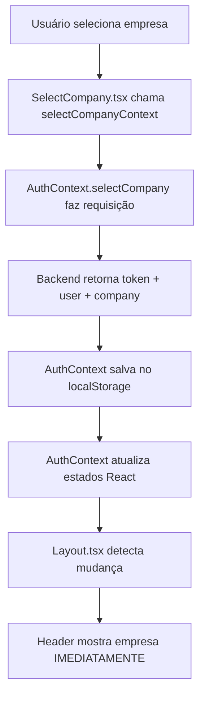

# 🎉 Correção: Empresa não aparecia imediatamente no header

## 🐛 Problema

Quando o usuário selecionava uma empresa após o login, o nome da empresa só aparecia no header **DEPOIS de recarregar a página** (F5).

### Por que acontecia?

O componente `SelectCompany.tsx` estava:
1. ✅ Salvando o token no `localStorage`
2. ✅ Salvando a empresa no `localStorage`
3. ❌ **NÃO estava atualizando o estado do React Context**

Resultado: O header só via a empresa depois de recarregar porque o `useEffect` do `AuthContext` lia do `localStorage` na inicialização.

## ✅ Solução Aplicada

### 1. `frontend/src/pages/SelectCompany.tsx`

**ANTES (errado):**
```typescript
const handleSelectCompany = async () => {
  const response = await api.post('/auth/select-company', {
    userId: user.id,
    companyId: selectedCompanyId,
  });
  
  // Salvava no localStorage mas não atualizava o Context!
  localStorage.setItem('@MES:token', response.data.token);
  localStorage.setItem('@MES:company', JSON.stringify(response.data.company));
  
  navigate('/dashboard');
};
```

**DEPOIS (correto):**
```typescript
const { selectCompany: selectCompanyContext } = useAuth();

const handleSelectCompany = async () => {
  // Chama a função do Context que atualiza o estado!
  await selectCompanyContext(selectedCompanyId);
  
  console.log('✅ Empresa selecionada com sucesso!');
  navigate('/dashboard');
};
```

### 2. `frontend/src/contexts/AuthContext.tsx`

**Melhorias:**
```typescript
const selectCompany = async (companyId: number): Promise<void> => {
  if (!user) {
    throw new Error('Usuário não autenticado');
  }

  const response = await authService.selectCompany(user.id, companyId);
  
  // Salvar token, usuário e empresa
  localStorage.setItem('@MES:token', response.token);
  localStorage.setItem('@MES:user', JSON.stringify(response.user));  // ✅ Novo
  localStorage.setItem('@MES:company', JSON.stringify(response.company));
  
  // Atualizar estados do React ✅
  setUser(response.user);  // ✅ Novo
  setSelectedCompany(response.company);
  
  console.log('🏢 [AuthContext] Empresa selecionada:', response.company.name);
};
```

## 🎯 Como Funciona Agora



## 🧪 Como Testar

### 1️⃣ Fazer Logout

Clique em "Sair" no canto superior direito.

### 2️⃣ Fazer Login

Email: `admin@admin.com`  
Senha: (sua senha)

### 3️⃣ Selecionar Empresa

Na tela de seleção, escolha **"EMPRESA TESTE"** (EMP001).

### 4️⃣ Verificar Header

**✅ Esperado:** O nome da empresa aparece **IMEDIATAMENTE** no header (sem precisar recarregar).

### 5️⃣ Verificar Console

Deve aparecer:
```
🏢 [AuthContext] Empresa selecionada: EMPRESA TESTE
✅ Empresa selecionada com sucesso!
```

## 📊 Antes vs Depois

| Ação | Antes | Depois |
|------|-------|--------|
| Selecionar empresa | Salva no localStorage | Salva no localStorage + Atualiza Context |
| Header | Não atualiza | ✅ Atualiza imediatamente |
| Precisa F5? | ❌ Sim | ✅ Não |

## 🔧 Arquivos Alterados

1. **`frontend/src/pages/SelectCompany.tsx`**
   - Usa `selectCompany` do contexto
   - Não faz mais chamada direta à API

2. **`frontend/src/contexts/AuthContext.tsx`**
   - Atualiza `setUser` quando empresa é selecionada
   - Adiciona log para debug

3. **`frontend/src/services/api.ts`** (correção anterior)
   - Busca token com chave correta `@MES:token`

## 🎯 Status Final

| Item | Status |
|------|--------|
| Token gerado com `companyId` | ✅ OK |
| Token salvo no localStorage | ✅ OK |
| Token enviado nas requisições | ✅ OK |
| Backend recebe `companyId` | ✅ OK |
| KPIs filtrados por empresa | ✅ OK |
| Empresa aparece no header imediatamente | ✅ **CORRIGIDO** |

---

**Criado em:** 23/10/2025  
**Status:** ✅ **CORRIGIDO** - Teste agora!  
**Solução:** Usar o Context do React em vez de manipular localStorage diretamente

