# 🏢 Sistema Multi-Empresa - Implementação Completa

## 📋 Resumo

Sistema implementado para permitir que colaboradores sejam vinculados a múltiplas empresas e filtrem dados por empresa selecionada.

---

## 🎯 Funcionalidades Implementadas

### 1. **Estrutura de Banco de Dados** ✅

#### Modelo `User` (Atualizado)
```prisma
model User {
  id                 Int       @id @default(autoincrement())
  selectedCompanyId  Int? // ← NOVO: Empresa atualmente selecionada
  
  userCompanies      UserCompany[] // Empresas vinculadas
  selectedCompany    Company? @relation("UserSelectedCompany")
}
```

#### Modelo `UserCompany` (Many-to-Many)
```prisma
model UserCompany {
  id        Int      @id @default(autoincrement())
  userId    Int
  companyId Int
  isDefault Boolean  @default(false) // Empresa padrão
  
  user    User    @relation(...)
  company Company @relation(...)
  
  @@unique([userId, companyId])
}
```

#### Modelo `Company` (Atualizado)
```prisma
model Company {
  id        Int      @id @default(autoincrement())
  
  sectors           Sector[]
  productionOrders  ProductionOrder[] // Ordens vinculadas
  userCompanies     UserCompany[]
  selectedByUsers   User[] @relation("UserSelectedCompany") // ← NOVO
}
```

---

## 🔐 Autenticação e Seleção de Empresa

### Fluxo de Login

#### 1. **Login Inicial**
**Endpoint**: `POST /api/auth/login`

**Request**:
```json
{
  "email": "user@example.com",
  "password": "senha123"
}
```

**Response** (usuário com múltiplas empresas):
```json
{
  "token": null,
  "user": {
    "id": 1,
    "email": "user@example.com",
    "name": "João Silva",
    "role": "OPERATOR"
  },
  "companies": [
    {
      "id": 1,
      "code": "EMP001",
      "name": "Empresa ABC",
      "tradeName": "ABC Ltda",
      "isDefault": true
    },
    {
      "id": 2,
      "code": "EMP002",
      "name": "Empresa XYZ",
      "tradeName": "XYZ SA",
      "isDefault": false
    }
  ],
  "requiresCompanySelection": true
}
```

**Response** (usuário com uma empresa):
```json
{
  "token": "eyJhbGciOiJIUzI1NiIsInR5cCI6IkpXVCJ9...",
  "user": { ... },
  "companies": [ ... ],
  "requiresCompanySelection": false
}
```

#### 2. **Seleção de Empresa**
**Endpoint**: `POST /api/auth/select-company`

**Request**:
```json
{
  "userId": 1,
  "companyId": 1
}
```

**Response**:
```json
{
  "token": "eyJhbGciOiJIUzI1NiIsInR5cCI6IkpXVCJ9...",
  "user": {
    "id": 1,
    "email": "user@example.com",
    "name": "João Silva",
    "role": "OPERATOR",
    "selectedCompanyId": 1
  },
  "company": {
    "id": 1,
    "code": "EMP001",
    "name": "Empresa ABC",
    "tradeName": "ABC Ltda"
  }
}
```

---

## 🔑 JWT e Payload

### Estrutura do Token
```typescript
interface JwtPayload {
  userId: number;
  role: string;
  companyId?: number; // Empresa selecionada
}
```

**Exemplo decodificado**:
```json
{
  "userId": 1,
  "role": "OPERATOR",
  "companyId": 1,
  "iat": 1729641000,
  "exp": 1729669800
}
```

---

## 🛡️ Middlewares

### 1. **injectCompanyId**
Extrai `companyId` do token JWT e adiciona em `req.user`.

```typescript
// Uso automático em todas as rotas protegidas
import { injectCompanyId } from '../middleware/companyFilter';

router.use(injectCompanyId); // Injeta em todas as rotas
```

### 2. **requireCompany**
Exige que usuário tenha uma empresa selecionada.

```typescript
import { requireCompany } from '../middleware/companyFilter';

router.get('/orders', requireCompany, listProductionOrders);
```

**Resposta** (se não tiver empresa):
```json
{
  "error": "É necessário selecionar uma empresa para acessar este recurso",
  "requiresCompanySelection": true
}
```

### 3. **getCompanyFilter**
Helper para adicionar filtro de empresa nas queries.

```typescript
import { getCompanyFilter } from '../middleware/companyFilter';

export async function listProductionOrders(req: AuthenticatedRequest, res: Response) {
  const where: any = {
    ...getCompanyFilter(req, false), // { companyId: 1 }
    status: 'ACTIVE',
  };
  
  const orders = await prisma.productionOrder.findMany({ where });
}
```

---

## 📊 Controllers Atualizados

### ProductionOrderController

#### **listProductionOrders** ✅
```typescript
export async function listProductionOrders(req: AuthenticatedRequest, res: Response) {
  const where: any = {
    ...getCompanyFilter(req, false), // Filtra por empresa
    // outros filtros...
  };
  
  const orders = await prisma.productionOrder.findMany({ where });
}
```

#### **createProductionOrder** ✅
```typescript
export async function createProductionOrder(req: AuthenticatedRequest, res: Response) {
  const companyId = req.user?.companyId;
  
  const order = await prisma.productionOrder.create({
    data: {
      orderNumber: "OP-001",
      companyId, // ← Vincula à empresa
      // ...outros campos
    },
  });
}
```

---

## 🎨 Frontend - Fluxo de UI

### 1. **Tela de Login**
```tsx
// Login.tsx
const handleLogin = async () => {
  const response = await api.post('/auth/login', { email, password });
  
  if (response.data.requiresCompanySelection) {
    // Mostrar tela de seleção de empresa
    navigate('/select-company', { 
      state: { 
        user: response.data.user,
        companies: response.data.companies,
      },
    });
  } else {
    // Tem apenas uma empresa - logar direto
    localStorage.setItem('token', response.data.token);
    navigate('/dashboard');
  }
};
```

### 2. **Tela de Seleção de Empresa**
```tsx
// SelectCompany.tsx
import { useState } from 'react';
import { useLocation, useNavigate } from 'react-router-dom';

export default function SelectCompany() {
  const location = useLocation();
  const navigate = useNavigate();
  const { user, companies } = location.state;
  
  const [selectedCompany, setSelectedCompany] = useState(
    companies.find(c => c.isDefault)?.id || companies[0].id
  );
  
  const handleSelectCompany = async () => {
    const response = await api.post('/auth/select-company', {
      userId: user.id,
      companyId: selectedCompany,
    });
    
    localStorage.setItem('token', response.data.token);
    localStorage.setItem('company', JSON.stringify(response.data.company));
    navigate('/dashboard');
  };
  
  return (
    <div>
      <h1>Selecione a Empresa</h1>
      {companies.map(company => (
        <Card 
          key={company.id}
          onClick={() => setSelectedCompany(company.id)}
          selected={selectedCompany === company.id}
        >
          <h2>{company.name}</h2>
          <p>{company.tradeName}</p>
          {company.isDefault && <Badge>Padrão</Badge>}
        </Card>
      ))}
      <Button onClick={handleSelectCompany}>Continuar</Button>
    </div>
  );
}
```

### 3. **Header com Empresa Selecionada**
```tsx
// Header.tsx
const company = JSON.parse(localStorage.getItem('company') || '{}');

return (
  <AppBar>
    <Toolbar>
      <Typography>{company.name}</Typography>
      <IconButton onClick={handleChangeCompany}>
        <BusinessIcon />
      </IconButton>
    </Toolbar>
  </AppBar>
);
```

---

## 🔄 Fluxo Completo

```mermaid
sequenceDiagram
    participant U as Usuário
    participant F as Frontend
    participant A as Auth API
    participant D as Data API
    
    U->>F: Faz login
    F->>A: POST /auth/login
    A->>A: Busca userCompanies
    
    alt Múltiplas empresas
        A->>F: { requiresCompanySelection: true, companies: [...] }
        F->>U: Mostra tela de seleção
        U->>F: Seleciona empresa
        F->>A: POST /auth/select-company { companyId }
        A->>A: Atualiza selectedCompanyId
        A->>A: Gera token com companyId
        A->>F: { token, company }
    else Uma empresa
        A->>A: Gera token com companyId
        A->>F: { token }
    end
    
    F->>F: Salva token no localStorage
    F->>D: GET /api/orders (com token)
    D->>D: Extrai companyId do token
    D->>D: Filtra orders por companyId
    D->>F: Retorna dados da empresa
```



---

## 📝 Checklist de Implementação

### Backend ✅
- [x] Adicionar `selectedCompanyId` no modelo `User`
- [x] Criar relação `UserCompany` (many-to-many)
- [x] Migration aplicada (`npx prisma db push`)
- [x] Endpoint `POST /auth/login` retorna empresas
- [x] Endpoint `POST /auth/select-company` criado
- [x] Middleware `injectCompanyId` criado
- [x] Middleware `requireCompany` criado
- [x] Helper `getCompanyFilter` criado
- [x] ProductionOrderController atualizado
- [ ] Outros controllers atualizados (opcional)

### Frontend 🔄
- [ ] Tela de seleção de empresa
- [ ] Lógica de login multi-empresa
- [ ] Header com empresa selecionada
- [ ] Opção de trocar empresa
- [ ] Atualizar API calls para incluir token

---

## 🎯 Próximos Passos

### 1. **Criar Tela de Seleção de Empresa (Frontend)**
```bash
cd frontend/src/pages
# Criar SelectCompany.tsx
```

### 2. **Atualizar Login.tsx**
- Verificar `requiresCompanySelection`
- Redirecionar para seleção se necessário

### 3. **Adicionar Middleware nas Rotas**
```typescript
// backend/src/routes/productionOrderRoutes.ts
import { injectCompanyId, requireCompany } from '../middleware/companyFilter';

router.use(injectCompanyId); // Injeta companyId em todas as rotas
router.get('/', requireCompany, listProductionOrders); // Exige empresa
```

### 4. **Criar Sistema de Troca de Empresa**
- Botão no header para trocar empresa
- Modal com lista de empresas do usuário

---

## 🚀 Benefícios

✅ **Multi-tenancy**: Dados isolados por empresa  
✅ **Segurança**: Usuários só veem dados da empresa selecionada  
✅ **Flexibilidade**: Um usuário pode trabalhar em múltiplas empresas  
✅ **Auditoria**: Rastreabilidade de qual empresa cada ação pertence  
✅ **Escalabilidade**: Fácil adicionar novas empresas  

---

## ⚠️ Considerações

1. **Administradores**: Podem ter acesso a todas as empresas?
   - Criar role especial ou permissão global

2. **Cadastros globais**: Alguns cadastros não pertencem a empresa?
   - Moldes, itens, etc. podem ser globais ou por empresa
   - Adicionar `companyId` opcional nesses modelos

3. **Performance**: Índices no `companyId`
   ```prisma
   @@index([companyId])
   ```

4. **Migração de dados existentes**: Ordens antigas sem empresa?
   - Criar empresa "padrão" e associar

---

**Status**: ✅ Backend implementado | 🔄 Frontend pendente  
**Data**: 22/10/2025
**Versão**: 1.0
