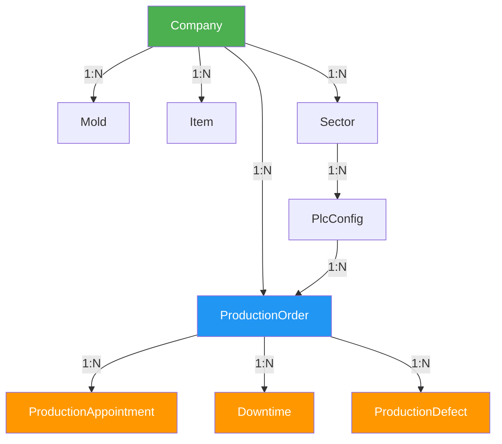

# 🏢 Vínculo da Empresa com Registros - Explicação Detalhada

## 📊 Estrutura Atual do Banco de Dados

### Resumo do Vínculo com `companyId`

| Tabela | Tem companyId? | Tipo de Vínculo | Observação |
|--------|---------------|-----------------|------------|
| **ProductionOrder** | ✅ Sim | Direto | `companyId Int?` (opcional) |
| **Mold** | ✅ Sim | Direto | `companyId Int?` (opcional) |
| **Item** | ✅ Sim | Direto | `companyId Int?` (opcional) |
| **Sector** | ✅ Sim | Direto | `companyId Int` (obrigatório) |
| **ProductionAppointment** | ❌ Não | **INDIRETO** | Através de `ProductionOrder` |
| **Downtime** | ❌ Não | **INDIRETO** | Através de `ProductionOrder` |
| **ProductionDefect** | ❌ Não | **INDIRETO** | Através de `ProductionOrder` |
| **PlcConfig** | ❌ Não | **INDIRETO** | Através de `Sector` |

---

## 🔗 Fluxo de Vínculo - Como os Apontamentos se Conectam à Empresa



### Legenda:
- 🟢 **Verde**: Empresa (Company)
- 🔵 **Azul**: Ordem de Produção (ProductionOrder) - **Ponto Central**
- 🟠 **Laranja**: Registros sem vínculo direto

---

## 📋 Detalhamento dos Vínculos

### 1️⃣ **ProductionOrder** (Ordem de Produção)
```prisma
model ProductionOrder {
  id               Int              @id
  companyId        Int?             // ← VÍNCULO DIRETO
  
  company          Company?         @relation(...)
  productionAppointments ProductionAppointment[]
  downtimes        Downtime[]
  productionDefects ProductionDefect[]
}
```

✅ **Vínculo**: Direto através do campo `companyId`  
⚠️ **Problema**: É opcional (`Int?`), pode ser `null`

---

### 2️⃣ **Mold** (Molde)
```prisma
model Mold {
  id              Int       @id
  companyId       Int?      // ← VÍNCULO DIRETO
  
  company         Company?  @relation(...)
  productionOrders ProductionOrder[]
}
```

✅ **Vínculo**: Direto através do campo `companyId`  
⚠️ **Problema**: É opcional (`Int?`), pode ser `null`

---

### 3️⃣ **ProductionAppointment** (Apontamento de Produção)
```prisma
model ProductionAppointment {
  id                Int      @id
  productionOrderId Int      // ← VÍNCULO INDIRETO
  
  productionOrder   ProductionOrder @relation(...)
  // NÃO TEM companyId!
}
```

❌ **Sem vínculo direto**  
🔗 **Vínculo indireto**: `ProductionAppointment` → `ProductionOrder` → `Company`

**Para buscar apontamentos de uma empresa:**
```typescript
// ❌ NÃO FUNCIONA (não tem companyId direto)
const apontamentos = await prisma.productionAppointment.findMany({
  where: { companyId: 1 }  // ERRO: campo não existe!
});

// ✅ FUNCIONA (através da ordem)
const apontamentos = await prisma.productionAppointment.findMany({
  where: {
    productionOrder: {
      companyId: 1  // Filtra pela empresa da ordem
    }
  },
  include: {
    productionOrder: {
      include: { company: true }
    }
  }
});
```

---

### 4️⃣ **Downtime** (Paradas)
```prisma
model Downtime {
  id                Int          @id
  productionOrderId Int?         // ← VÍNCULO INDIRETO
  
  productionOrder   ProductionOrder? @relation(...)
  // NÃO TEM companyId!
}
```

❌ **Sem vínculo direto**  
🔗 **Vínculo indireto**: `Downtime` → `ProductionOrder` → `Company`

---

## 🎯 Como Filtrar por Empresa - Exemplos Práticos

### 1. **Listar Ordens de Produção da Empresa**
```typescript
// ✅ FÁCIL - Tem companyId direto
const orders = await prisma.productionOrder.findMany({
  where: {
    companyId: req.user?.companyId
  }
});
```

### 2. **Listar Moldes da Empresa**
```typescript
// ✅ FÁCIL - Tem companyId direto
const molds = await prisma.mold.findMany({
  where: {
    companyId: req.user?.companyId
  }
});
```

### 3. **Listar Apontamentos da Empresa**
```typescript
// ⚠️ REQUER JOIN - Vínculo indireto
const appointments = await prisma.productionAppointment.findMany({
  where: {
    productionOrder: {
      companyId: req.user?.companyId  // ← JOIN com ProductionOrder
    }
  },
  include: {
    productionOrder: {
      include: {
        item: true,
        mold: true,
        company: true
      }
    },
    user: true
  }
});
```

### 4. **Listar Paradas (Downtimes) da Empresa**
```typescript
// ⚠️ REQUER JOIN - Vínculo indireto
const downtimes = await prisma.downtime.findMany({
  where: {
    productionOrder: {
      companyId: req.user?.companyId
    }
  },
  include: {
    productionOrder: true,
    activityType: true
  }
});
```

---

## 🚨 Problemas Identificados

### ❌ Problema 1: `companyId` Opcional nas Principais Tabelas
```prisma
model ProductionOrder {
  companyId Int?  // ← Pode ser NULL!
}

model Mold {
  companyId Int?  // ← Pode ser NULL!
}

model Item {
  companyId Int?  // ← Pode ser NULL!
}
```

**Impacto**: 
- Ordens antigas sem empresa associada
- Moldes/Itens compartilhados entre empresas
- Filtros podem não pegar todos os registros

### ❌ Problema 2: Apontamentos Sem Vínculo Direto
```prisma
model ProductionAppointment {
  productionOrderId Int  // Só vínculo indireto
  // companyId ???     ← NÃO EXISTE!
}
```

**Impacto**:
- Queries mais complexas (requerem JOIN)
- Performance reduzida em grandes volumes
- Risco de apontamentos órfãos se ordem for deletada

---

## ✅ Soluções Propostas

### Solução 1: **Adicionar `companyId` nos Apontamentos** (Recomendado)

#### Migration SQL:
```sql
-- Adicionar companyId em production_appointments
ALTER TABLE production_appointments 
ADD COLUMN company_id INTEGER;

-- Preencher com base na ordem de produção
UPDATE production_appointments pa
SET company_id = po.company_id
FROM production_orders po
WHERE pa.production_order_id = po.id;

-- Adicionar foreign key
ALTER TABLE production_appointments
ADD CONSTRAINT fk_production_appointments_company
FOREIGN KEY (company_id) REFERENCES companies(id);

-- Criar índice para performance
CREATE INDEX idx_production_appointments_company_id 
ON production_appointments(company_id);
```

#### Schema Atualizado:
```prisma
model ProductionAppointment {
  id                Int      @id @default(autoincrement())
  productionOrderId Int
  companyId         Int      // ← NOVO CAMPO
  userId            Int
  quantity          Int
  // ... outros campos
  
  productionOrder ProductionOrder @relation(...)
  company         Company         @relation(...) // ← NOVA RELAÇÃO
  user            User            @relation(...)
  
  @@index([companyId, timestamp])  // ← NOVO ÍNDICE
}
```

**Vantagens**:
- ✅ Filtro direto, sem JOINs
- ✅ Performance melhorada
- ✅ Queries mais simples
- ✅ Índices eficientes

---

### Solução 2: **Tornar `companyId` Obrigatório nas Ordens**

```prisma
model ProductionOrder {
  companyId Int  // ← SEM "?", obrigatório!
}
```

**Migration**:
```sql
-- Associar ordens órfãs a uma empresa padrão
UPDATE production_orders 
SET company_id = (SELECT id FROM companies WHERE code = 'DEFAULT' LIMIT 1)
WHERE company_id IS NULL;

-- Tornar obrigatório
ALTER TABLE production_orders 
ALTER COLUMN company_id SET NOT NULL;
```

---

### Solução 3: **Criar Views para Facilitar Queries**

```sql
-- View de apontamentos com empresa
CREATE OR REPLACE VIEW v_production_appointments_with_company AS
SELECT 
  pa.*,
  po.company_id,
  c.name as company_name,
  c.code as company_code
FROM production_appointments pa
INNER JOIN production_orders po ON pa.production_order_id = po.id
LEFT JOIN companies c ON po.company_id = c.id;
```

Uso no código:
```typescript
// Usar a view
const result = await prisma.$queryRaw`
  SELECT * FROM v_production_appointments_with_company
  WHERE company_id = ${companyId}
`;
```

---

## 🎯 Recomendação Final

### **Opção A: Implementação Rápida (Sem Mudanças no Schema)**
✅ Usar filtros com JOIN:
```typescript
// Helper function
export function getAppointmentsByCompany(companyId: number) {
  return prisma.productionAppointment.findMany({
    where: {
      productionOrder: { companyId }
    },
    include: {
      productionOrder: {
        include: { company: true, item: true, mold: true }
      }
    }
  });
}
```

### **Opção B: Implementação Ideal (Com Migration)** ⭐ RECOMENDADO
1. Adicionar `companyId` em `ProductionAppointment`
2. Adicionar `companyId` em `Downtime`
3. Adicionar `companyId` em `ProductionDefect`
4. Tornar `companyId` obrigatório em `ProductionOrder`
5. Criar índices para performance

---

## 📖 Exemplo Completo de Controller

```typescript
// controllers/ProductionAppointmentController.ts
import { Request, Response } from 'express';
import { prisma } from '../lib/prisma';
import { AuthenticatedRequest } from '../types';

export async function listAppointments(req: AuthenticatedRequest, res: Response) {
  try {
    const companyId = req.user?.companyId;
    
    if (!companyId) {
      return res.status(400).json({ 
        error: 'Empresa não selecionada',
        requiresCompanySelection: true 
      });
    }
    
    // Filtro com JOIN (solução atual)
    const appointments = await prisma.productionAppointment.findMany({
      where: {
        productionOrder: {
          companyId: companyId  // ← Filtra pela empresa da ordem
        }
      },
      include: {
        productionOrder: {
          include: {
            company: true,
            item: true,
            mold: true
          }
        },
        user: {
          select: {
            id: true,
            name: true,
            email: true
          }
        }
      },
      orderBy: {
        timestamp: 'desc'
      }
    });
    
    return res.json(appointments);
  } catch (error) {
    console.error('Erro ao listar apontamentos:', error);
    return res.status(500).json({ error: 'Erro ao listar apontamentos' });
  }
}
```

---

## 🔍 Verificação Rápida no Banco

```sql
-- 1. Ver quantas ordens têm empresa vinculada
SELECT 
  COUNT(*) FILTER (WHERE company_id IS NOT NULL) as com_empresa,
  COUNT(*) FILTER (WHERE company_id IS NULL) as sem_empresa,
  COUNT(*) as total
FROM production_orders;

-- 2. Ver distribuição de apontamentos por empresa
SELECT 
  c.name as empresa,
  COUNT(pa.id) as total_apontamentos
FROM production_appointments pa
INNER JOIN production_orders po ON pa.production_order_id = po.id
LEFT JOIN companies c ON po.company_id = c.id
GROUP BY c.id, c.name
ORDER BY total_apontamentos DESC;

-- 3. Apontamentos órfãos (sem empresa)
SELECT COUNT(*) as apontamentos_sem_empresa
FROM production_appointments pa
INNER JOIN production_orders po ON pa.production_order_id = po.id
WHERE po.company_id IS NULL;
```

---

**Criado em**: 22/10/2025  
**Status**: 📊 Documentação de Arquitetura  
**Próximo Passo**: Escolher entre Opção A (rápida) ou Opção B (ideal)

